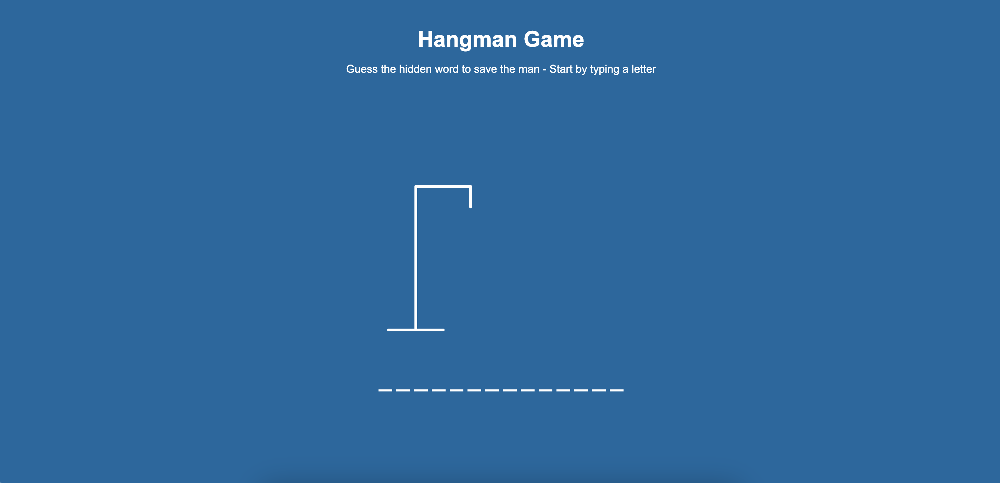
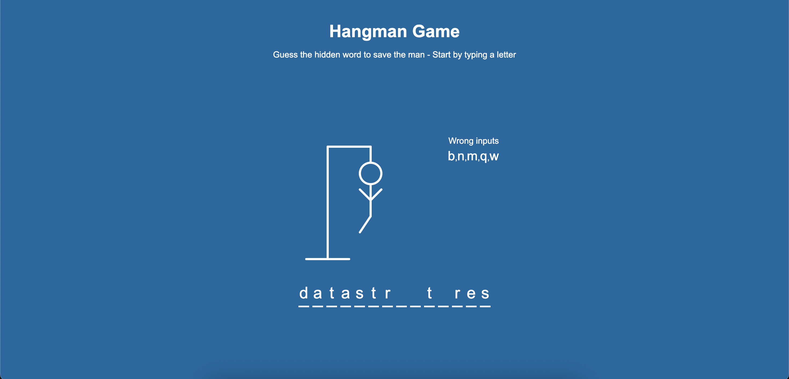
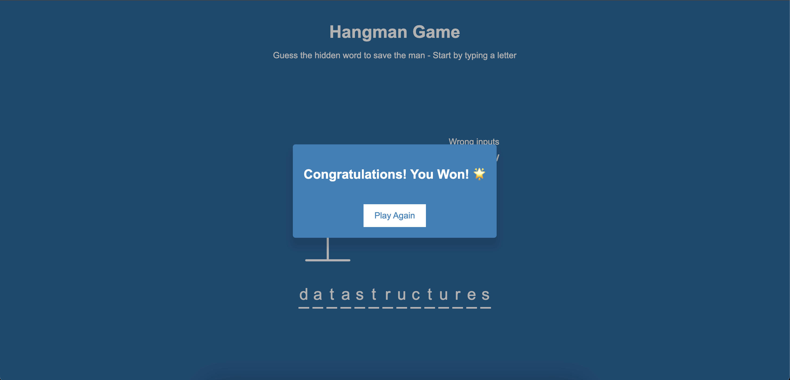

# Hangman Game

Try yourself: [Live demo](https://voice2post.netlify.app/)


## Description
With you buddy waiting to be saved, you just need to guess the word in fixed number of tries or your friend dies!


## Instructions
You need to guess the word, with numbers of letters represented by the number of blank positions that exist in the bottom of the screen. Whenever key is pressed, every correct letter will take its correct position in the blank provided and every incorrect letter will appear in the list of incorrect words. Make sure to guess the word before the hangman dies.


## Learnings
1. event.keycode and event.which have been deprecated, instead use event.key or event.code:
    - ```
        (keyCode >= 65 && keyCode <= 90) || /^[a-zA-Z]$/.test(e.key)
        ```
2. empty an array using:
    - arr.splice(0)
    - arr.length = 0
3. SVG line and circle elements. eg:
    - ```
        <line x1="0" y1="0" x2="300" y2="200" style="stroke:red;stroke-width:2" />
        ```
        - x1, x2 -> dimensions along x-axis (same for Y-axis)
    - ```
        <circle r="45" cx="50" cy="50" fill="red" />
        ```
        - r -> radius
        - cx -> centre's position on X-axis (same for Y-axis)


## Snapshots

1. Initial screen




2. Intermediate screen




2. Final screen




